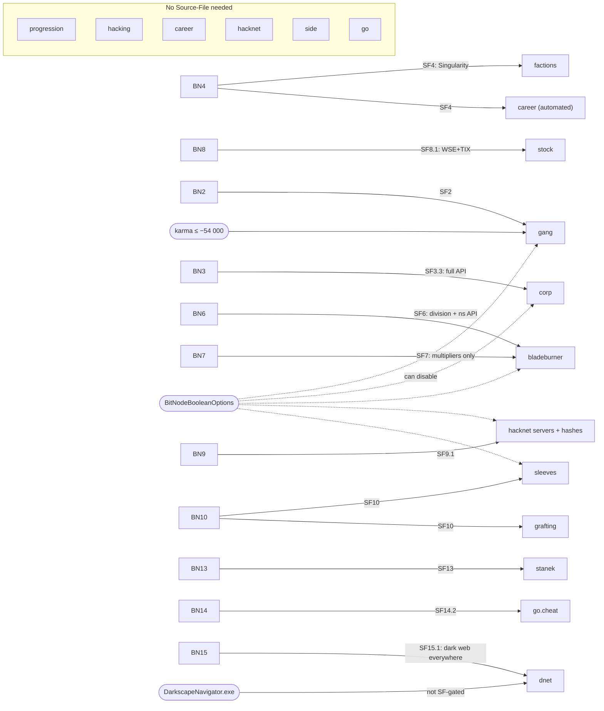
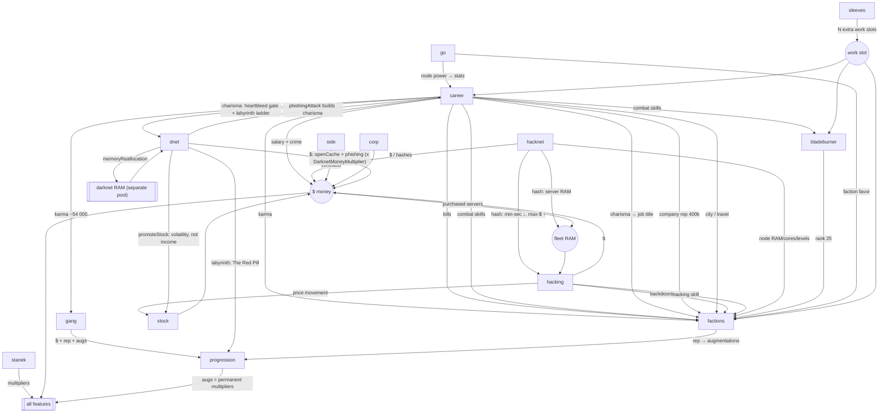

# The feature graph

Two graphs over the same fourteen features, kept apart because they answer
different questions:

- **Unlock** — *"may I play this at all?"* Edges are BitNodes, Source-Files and
  BitNode options. Static within a run.
- **Resource** — *"what does playing this cost and yield?"* Edges are resources
  one feature produces and another consumes. This is where strategy lives, and
  the needs board (`shared/strategy/needs.ts`) already speaks its vocabulary.

Conflating them is the mistake worth avoiding: `gang` is *unlock*-gated on SF2
but *resource*-gated on −54 000 karma, and those need different responses —
wait forever vs. go do crime.

---

## 1. Unlock



An edge from BN*n* means "destroy BN*n* for SF*n*, which unlocks this
everywhere". Playing *in* BN*n* unlocks it for that run.

**SF4 is the keystone for an automation codebase.** Without it there is no
`factions` and no automatable `career`, so no reset loop — which is what
actually beats BitNodes. Everything else here is a feature; SF4 is the
difference between a script that farms and a script that plays. Its cost is
continuous, not binary: Singularity RAM is 16× / 4× / 1× by level, and a single
`SingularityFn3` call is 80 GB at SF4.1 with no dodge-split that helps.

**A Source-File is not sufficient.** `BitNodeBooleanOptions` can disable gang,
corp, bladeburner, 4S data, hacknet servers and sleeve exp/augs per run, and
`sourceFileOverrides` can lower an active SF level. `ns.getResetInfo()` returns
`currentNode`, `ownedAugs`, `ownedSF` (already options-aware) and
`bitNodeOptions` — all for 1 GB, which our gate probe already spends.
`shared/features/unlock.ts` should read it rather than inferring from SF level.

**Two-stage unlocks.** `corp` splits at SF3.3 (full API) and `go` at SF14.2
(`go.cheat`); `Feature.api` exists so a tab can say "playable, not scriptable"
rather than rendering empty. Note `bladeburner` is **not** such a split —
BN6/SF6 already grants the ns API.

---

## 2. Resource



Three things a list does not show:

1. **`career` is the root** — most outbound edges, almost no inbound. Nearly
   every gate bottoms out in "spend the work slot".
2. **`factions` is the sink** — consumes from seven features, produces one
   thing. That is the game's shape: everything converges on rep, rep buys
   permanent multipliers, multipliers make everything faster.
3. **`sleeves` alone produces the work slot.** Everything else competes for it.

---

## 3. Shared resources

Who makes it, who spends it, and — the part easy to get wrong — what survives a
reset. Three levels: *install* (buying augs), *node* (destroying a BitNode),
*permanent* (Source-Files).

| Resource | Produced by | Consumed by | Survives install? | Survives node? |
|---|---|---|---|---|
| **Work slot** (`Player.currentWork`) | time; multiplied by `sleeves` | `career`, `factions`, `bladeburner`, grafting, program creation, class/gym | n/a | n/a |
| **Money** | `hacking`, `career`, `hacknet`, `corp`, `stock`, `gang`, `side`, `dnet` (node-dependent: `DarknetMoneyMultiplier` is 0 in BN8, 0.05 in BN9) | everything | **No** → $1000 | No |
| **Karma** | crime only (player, sleeves, gang) | `factions` invites, `gang` (−54 000) | **Yes** | No |
| **Kills** | Homicide, Assassination | `factions` (Dark Army 5, Speakers 30) | **No** → 0 | No |
| **Faction reputation** | faction work, donations, `side`, `go`, `gang` | augmentation purchases | **No** → converted to favor | No |
| **Faction favor** | rep, at install, via `addRepToFavor` | +1% rep rate per point; donations at 150 | **Yes** | No |
| **Company reputation** | company work | `factions` (ten megacorps, 400k) | **No** (favor kept) | No |
| **Company favor** | company rep at install | rep rate; with SF11 also **salary** | **Yes** | No |
| **Skills** (hacking, combat, charisma) | exp | server access, invites, job titles | **No** → 1 | No |
| **Intelligence** | many actions, slowly (BN5/SF5) | production bonuses everywhere | **Yes** | **Yes — the only stat** |
| **Augmentations owned** | `factions`, grafting, `gang`, `dnet` labyrinth | `progression`; counts toward Daedalus | **Yes** | No |
| **Home RAM** | money | our scripts, dodges, probes, the farm | **Yes** | No |
| **Fleet RAM** | purchased + rooted + hacknet servers | dispatch, dodge placement, `stanek` charging | **No** | No |
| **Darknet RAM** | `dnet` `memoryReallocation` on hosts we hold | dnet agents only — never in `ns.scan`, never in the heap, partly owner-blocked, and able to vanish | **No** | No |
| **Programs** (port openers) | darkweb ($) or creation (work slot + skill) | rooting, therefore the whole fleet | **No** → NUKE plus augmentation/SF-granted programs (and BitFlume) | No → the new node's grants (and BitFlume) |
| **City** | travel, $200 000 | city factions, Tetrads, Dark Army, Syndicate, Tian Di Hui | **No** → Sector-12 | No |
| **Source-File levels** | destroying BitNodes | everything on graph 1 | Yes | **Yes** |

### The three that decide plans

**The work slot** is the scarcest resource in the game.
`ns.singularity.workForFaction` **cancels** whatever is running — the loser's
progress is destroyed, not delayed — so allocation needs pre-emption rules, not
fairness rules. Sleeves are the only relief.

**Karma vs. kills.** The two counters reset in different functions
(`PlayerObjectGeneralMethods.ts`): `prestigeAugmentation` — run on **install** —
sets `numPeopleKilled = 0` and never touches karma; `prestigeSourceFile` — run
on **node reset** — calls it and *then* sets `karma = 0`. Those are the only
writes outside the crime increments. So karma is banked for a whole node; kills
are wiped every install.

The consequence is narrower than it looks, because Speakers for the Dead is
`keepOnInstall: false` — you re-qualify from scratch anyway, including combat
300 from skill 1, and rebuilding that with Homicide produces the 30 kills as a
side effect. So:

- Karma requirements (−9 … −90) are paid **once per node**, then nearly free.
- Kill requirements rarely cost extra *time*; they cost **optionality**, forcing
  the combat rebuild through Homicide rather than the gym or a richer crime.
  That is an objective weight in `career`, not a separate task.
- The gang's −54 000 is ~15 000 s of Homicide at the theoretical cap, so many
  hours in practice. Being banked per-node is what makes it survivable.

Faction membership does **not** survive an augmentation install. Eligible
factions may preserve or regain an invitation, but `membership` and enemy bans
are cleared, so the city/enemy choice is made again every install cycle.
Installed augmentations and faction favor survive; faction reputation is banked
into favor and then reset to zero.

**Rep vs. favor** is what makes the reset loop non-obvious. Rep is destroyed on
install and converted to favor; favor is permanent, compounds at +1% rep rate
per point, and unlocks donations at 150. So the optimal number of installs is
not "as few as possible" — each one converts perishable rep into permanent rate,
while ×1.9 aug escalation pushes the other way. That trade is what `progression`
must solve and what the simulator should measure.

---

## 4. Critical paths

### The BN1 spine — no Source-Files needed

```
root servers → hacking exp → hacking skill ─┬→ backdoor CSEC         → CyberSec
                                            ├→ backdoor avmnite-02h  → NiteSec
                                            ├→ backdoor I.I.I.I      → The Black Hand
                                            └→ backdoor run4theh111z → BitRunners
                                                        │
$ → TOR ($200k) → port openers ─────────────────────────┘
                                                        ↓
                              faction rep → augmentations → 30 augs
                                                        ↓
                    $100b + hacking 2500 ────────→ Daedalus
                                                        ↓
                                2.5m rep → The Red Pill → INSTALL
                                                        ↓
                              regrow to hacking 3000 → w0r1d_d43m0n
```

Inputs are hacking skill and money only — no karma, combat, job or travel. That
is what makes BN1 the right first target: its critical path uses one feature.

### The karma chain

```
career: Homicide (3 karma / 3 s, +1 kill)
   ├─ −9      → Slum Snakes   (+ combat 30, $1m)
   ├─ −18     → Tetrads       (+ combat 75, city CQ/NT/Ish)
   ├─ −22     → Silhouette    (+ CTO/CFO/CEO, $15m)
   ├─ −45     → Speakers      (+ combat 300, hacking 100, 30 kills, no CIA/NSA)
   ├─ −45     → Dark Army     (+ combat 300, hacking 300, 5 kills, Chongqing, no CIA/NSA)
   ├─ −90     → Syndicate     (+ combat 200, hacking 200, $10m, Aevum/S-12, no CIA/NSA)
   └─ −54 000 → gang          (outside BN2, with SF2)
```

Because the board is outcome-based, `factions` posting `karma −45` and `gang`
posting `karma −54 000` **add** into one weight: `career` commits Homicide once
and satisfies both. `quitCompany` on that list is a rare *negative* need — one
feature asking another to stop — which is why `NeedKind` has it.

### Augmentations — four sources

```
factions: rep → augs          ← default; gated on the work slot
gang:     respect → augs      ← BN2/SF2; largest pool; no work slot
grafting: money + time → augs ← BN10/SF10; costs entropy, not rep
dnet:     labyrinth → augs    ← SF15; includes The Red Pill
```

All four feed `progression`'s aug count, which Daedalus gates on (30 in BN1, 20
in BN15, 35 in BN6/7, up to 40 in deep BN12). The gang route changes the
problem's *shape* — it removes the work slot from the augmentation path.

### Ending a node — four routes, not one

`ns.singularity.destroyW0r1dD43m0n` accepts two entirely different proofs
(`NetscriptFunctions/Singularity.ts:1170`), and The Red Pill has three sources,
so there are four real routes. `shared/strategy/progression/endgame.ts` models
all four:

| Route | Requires | Available |
|---|---|---|
| **Daedalus** | 30 augs (node-dependent), $100b, hacking 2500 **or** combat 1500, then 2.5m rep → Red Pill → install → regrow to the world-daemon skill | every node except BN15 |
| **BN2 gang** | create an eligible gang, then 2.5m gang-faction rep → Red Pill → install → regrow | BN2 only |
| **Labyrinth** | dark web access, then walk the lab sequence → Red Pill → install → regrow | every node except **BN8**, with BN15 or SF15 |
| **Bladeburner** | all **20** black operations; the last needs rank **400 000** | anywhere we hold Bladeburner |

Two things that a Red-Pill-shaped planner gets wrong:

- **The Bladeburner route needs no Red Pill and no hacking level at all.** It is
  not a variation on the others; it shares none of their prerequisites.
- **All three Red Pill routes share a tail that is easy to under-count.** The
  `The-Cave ↔ w0r1d_d43m0n` link is created *during the install*, and the
  install resets hacking to 1. So the world-daemon climb happens **after** the
  install carrying the pill — never before. Collapsing "reach 2500 for
  Daedalus" and "reach 3000 for the daemon" into one milestone hides an entire
  regrow phase, which is why the `bn:` goal preset keeps them separate.

The ns check is also weaker than the terminal's: it wants
`hacking >= required && hasAdminRights` — **root, not a backdoor** — and sets
`backdoorInstalled` itself.

---

## 5. How the graph deforms per BitNode

| Node | Effect on the graph |
|---|---|
| BN2 | Farm to 8%, crime ×3, passive rep 0. `gang` replaces both the farm and the faction grind, and sells the Red Pill |
| BN3 | Every income ≤25%, augs ×3. Only `corp` scales; donations at 75 favor |
| BN4 | All five exp sources halved. Nothing favourable — the reward is the API |
| BN5 | Mild. Infiltration ×1.5 both axes; Intelligence becomes permanent |
| BN6/7 | Hacking edges nearly severed (0.35 level × 0.25 exp). Combat and rank replace them. Daedalus needs 35 |
| BN8 | **Deletes most edges**: company, crime, hacknet, contracts, infiltration, corp, gang, bladeburner all 0, hacked money not received, and the labyrinth Red Pill disabled. `stock` is the only producer |
| BN9 | `CloudServerLimit: 0` + home RAM ×5 — **fleet RAM** changes producer entirely, to hacknet |
| BN10 | Everything halved, augs ×5 money. `sleeves` multiplies the work slot to compensate |
| BN11 | Farm 1%, crime ×3, infiltration ×2.5 on money *and* rep. `ServerWeakenRate: 2` is a quiet prep buff |
| BN12 | Every edge scaled by `1.02^±lvl`. One-dimensional difficulty — our best A/B substrate |
| BN13 | Hardest hacking (0.25 × 0.1), every alternative nerfed. `stanek` at 2× is the only edge up |
| BN14 | Faction *and* company rep to 0.2×; `go` favor replaces them. `HackingSpeedMultiplier: 0.3` retimes every batch |
| BN15 | Mildest hacking nerf of the late nodes; Daedalus does not sell The Red Pill; charisma is buffed and the pill is in the labyrinth |

Two structural warnings:

- **`HackingSpeedMultiplier`** (BN14 0.3, BN15 0.6) changes HWGW *timing*. A
  dispatcher reading only `ScriptHackMoney` mis-times every batch there.
- **`CloudServerLimit: 0`** (BN9) and **`ScriptHackMoneyGain: 0`** (BN8) are
  *capability* changes wearing multiplier clothing. Code treating them as "a
  smaller number" will loop forever buying unbuyable servers, or report a
  working farm as broken.
